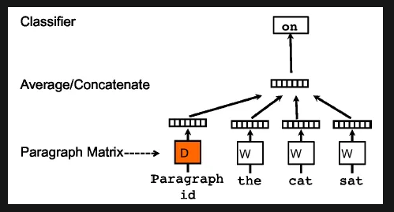

# Distributed Representations of Sentences and Documents

## Google
- The conventional way of representing text as a fixed length data (to be fed as input for ML models) is through bag of words. This has no positional encoding. Also it doesn't learn the real meaning of a word, as all words are equidistant when represented in space.
- A better way is by using word embeddings. Here, the model learns word embedding from a large text corpus, which represents the word in a high dimensional plane.

- This paper adds additional 'paragraph vector' to be used along with the word embeddings.
- More precisely, we concatenate the paragraph vector with several word vectors from a paragraph and predict the following word in the given context. 
- While paragraph vectors are unique among paragraphs, the word vectors are shared. At prediction time, the paragraph vectors are inferred by fixing the word vectors and training the new paragraph vector until convergence.

