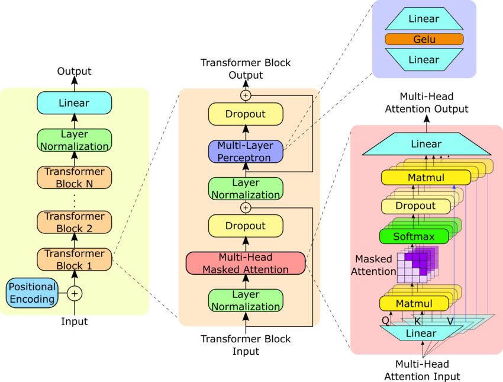

# Language Models are Unsupervised Multitask Learners
by Alec Radford, Jeffrey Wu ,Rewon Child, David Luan, Dario Amodei, Ilya Sutskever

# Problem Statement
- Explains the absence of models that are good at general NLP applications.
- Preliminary experiments confirmed that sufficiently large language models are able to
perform multitask learning from unsupervised approaches.
- Introduces GPT-2

# Dataset
- The training data is ensured to be of very high quality
- Uses Byte pair encoding

# Model
The model is based on the OpenAI GPT architecture with some modifications. Layer normalization is applied to the input of each sub-block, and an additional layer normalization is added after the final self-attention block. The model also uses a modified initialization that accounts for the accumulation on the residual path with model depth. The vocabulary size is expanded to 50,257, the context size is increased to 1024 tokens, and the batch size is set to 512.

# Performance
- The biggest GPT-2 model is 1.7B parameters. It achieves state of the art results on 7 out of 8 tested language modeling datasets
- demonstrates the potential of large-scale language models like GPT-2 to serve as a kind of "Swiss Army knife" for NLP tasks.

- The next few sections of the paper describes the performance of the model in various NLP tasks.

# Conclusion
When a large language model is trained on a sufficiently
large and diverse dataset it is able to perform well across
many domains and datasets.

