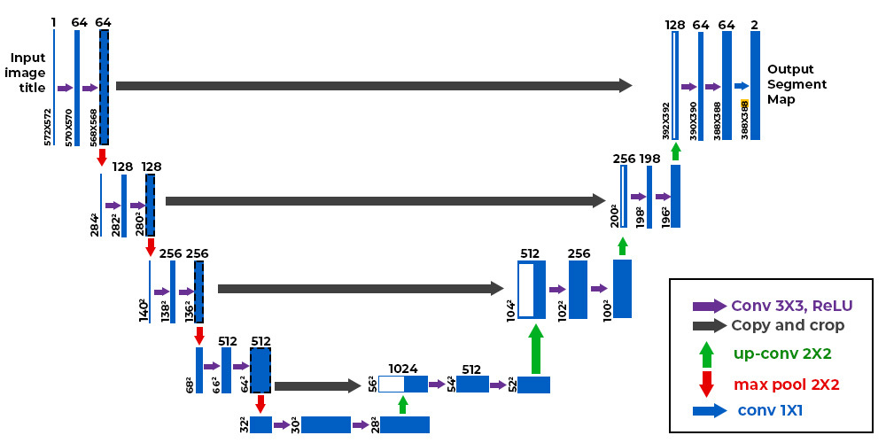
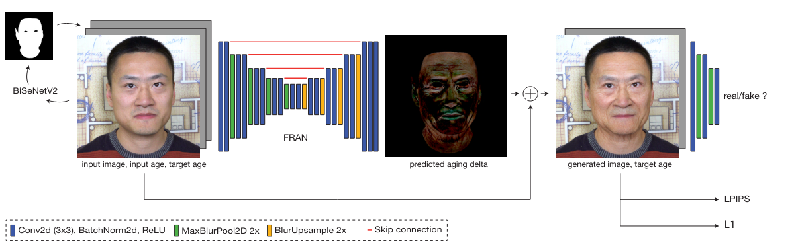

# Production-Ready Face Re-Aging for Visual Effects
### DisneyResearch, Dec 2022

# Problem
- Reaging actors to act in movies is hard.
  - without jitter in videos 
- If solved, can also be used in social media

# Current technique
- Current method
  - Involves reconstructing the face. Requires rendering it twice
  - Slow and hard work
  - Costly
- Researched up methods
  - Transformer based
  - deep RL based
  - GAN based
  - But accuracy is low, not good enough to be used

# Solution
- FRAN: face re-aging network
- take each frame of the video, and use FRAN network to convert the person's face to that of a different age.
- Focusing only on adult ages (18 - 85) -> children have diff(smaller) face structure

# Creating the dataset
- Cant make real datasets 
  - takes too long
  - Needs the same lighting, expressions, etc
- Makes synthetic images using latest re-aging tech
- although current re-aging approaches often fail on real face images they are fine to generate synthetic faces with photorealistic and consistent aging effects.
- Model used for this is Style-based Age Manipulation(SAM) 
- 2000 identities, with 14 age groups in the range of 18 to 85

# FRAN Model
- Input data
  - Original image
  - Current age and New age
  - Done to make sure the model doesn't have to guess the age -> so that the model can focus on re-aging alone 
- Model is a simple `U-net` model
  - CNN based
  - Encoder-decoder model, placed in U-shape
  - Very good for extacting segmented features from an image
  - Has skip connections to preserve spacial layout. This leads to good identity preservation, leading to less gitter in output.

- Output
  - Only output RGB offsets on the face
  - Models doesn't have to learn to generate the whole face
- GAN
  - GAN is used to reject wrong predictions as 'fake'
  - Generator and Discriminator
  

# Result
- Works in diff lighting, with motion blur, etc.
- Lowest mean identity loss
- The error is higher for 50+ ages
- target-map based reaging is also possible
- graying of scalp hair is not possible
- BMI changes as aging is not captured