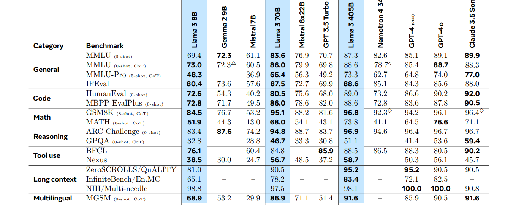

# The Llama 3 Herd of Models
### Llama Team, AI @ Meta

# Llama 3
- h 8B, 70B, and 405B parameters
- context window: 128K
- uses dense transformers - not mixture of expert architecture, for better stability
- Architecture is almost the same as llama2
  - Better and more data
  - Trained with more compute
  - simple post-training procedure basedon supervised finetuning, rejection sampling and direct preference optimization
- Llama 3 405B is trained on up to 16K H100 GPUs, each running at 700W TDP with 80GB HBM3,
using Meta’s Grand Teton AI server platform 

## Architecture
- Llama 3 405B uses an architecture with 126 layers, a token representation dimension of 16,384, and 128 attention heads
- Architecture is the same as that of Llama 2, with minor modifications

## Pretraining
- We pre-train Llama 3 405B using AdamW with a peak learning rate of 8e−5 , a linear warm up of 8,000 steps, and a cosine learning rate schedule decaying to 8 × 10−7 over 1,200,000 steps
- Pre-training is performed at massive scale: we pre-train a model with 405B parameters on 15.6T tokens using a context window of 8K tokens. This standard pre-training stage is followed by a continued pre-training stage that increases the supported context window to 128K tokens.
- The data mix contains roughly 50% of tokens corresponding to general knowledge, 25% of mathematical and reasoning tokens, 17% code tokens, and 8% multilingual tokens.
- Simulated annealing (SA) is a probabilistic algorithm in artificial intelligence (AI) that's used to find approximate solutions to optimization problems. It improved quality of 8B and 70B mdoel, but had negligible impact on the 405B model. 
- 
## Posttraining
Instruction fintetuning and Direct Preference Optimization(instead of RLHF). Then safety mitigations are done.

## Benchmark results
