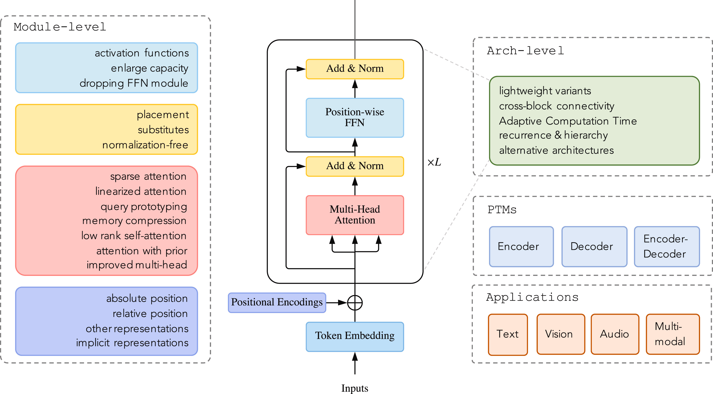
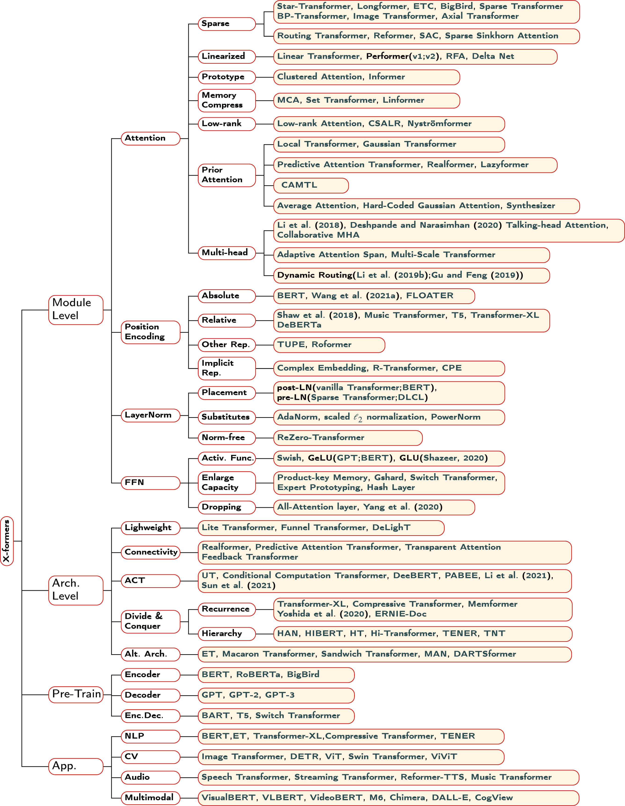
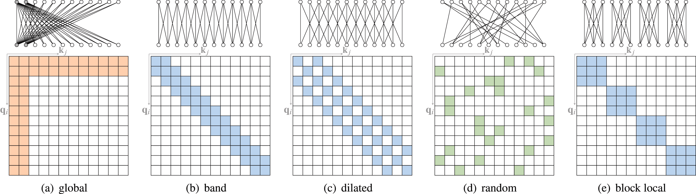
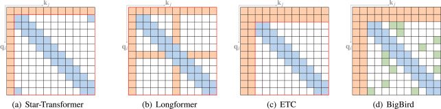
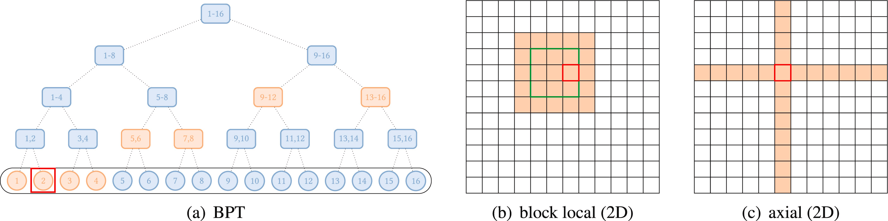

# A survey on Transformers
### - Tianyang Lin, Yuxin Wang , Xiangyang Li, Xipeng Qiu
https://www.sciencedirect.com/science/article/pii/S2666651022000146#sec1

# Introduction
- X-former is a term often used as shorthand for transformer
- The vanilla transformer has improved over time for:
  - Improved model efficiency - Computation and memory
  - Model Generalization
  - Model Adaptation - On other tasks

# Vanilla Transformer
- The vanilla Transformer is a sequence-to-sequence model and consists of an encoder and a decoder, each of which is a stack of N identical blocks.
- Each encoder block is mainly composed of a multi-head self-attention module and a position-wise feed-forward network (FFN). 
- For building a deeper model, a residual connection is employed around each module, followed by Layer Normalization module. 
- Compared to the encoder blocks, decoder blocks additionally insert cross-attention modules between the multi-head self-attention modules and the position-wise FFNs. 
- Furthermore, the self-attention modules in the decoder are adapted to prevent each position from attending to subsequent positions. 

## Types of Transformers
Three types of transformers:
1. Encoder only transformer
2. Decoder only transformer
3. Encoder-Decoder transformer

## Attention
Three types of attention:
1. Self-attention - in encoder to learn about input
2. Masked self-attention - in decoder(at the start) to do self-attention wihout looking into the future tokens(helpful in training)
3. Cross-attention - Uses encoder's Q and K with decoder's V matrix to decide attention values.

## Inductive bias
- Transformer is often compared against convolutional and recurrent networks.
- Convolutional networks are known to impose the inductive biases of translation invariance and locality with shared local kernel functions.
- Similarly, recurrent networks carry the inductive biases of temporal invariance and locality via their Markovian structure.
- On the other hand, the Transformer architecture makes few assumptions about structural information of data. 
This makes Transformer a universal and flexible architecture. 
As a side effect, the lack of structural bias makes Transformer prone to overfitting for small-scale data.

# Modification to vanilla transformers

# 1. Improvements on attention mechanism
1. Sparse Attention: Every token doesn't attends to every other token
   - Introduces sparsity bias into the attention mechanism, leading to reduced complexity.
   - Incorporates structural bias to limit the number of query–key pairs that each query attends to.
   - Two Types:
       1. Position-based sparse attention: Absence of connection is based on the position (pre-defined patterns)
         - Atomic attention: Any of the following
           
         - Compound sparse attention: Combination of the above atomic attentions
           
         - Extended sparse attention
           
       
       2. Content-based sparse attention: 
         - Another technique is to create a sparse graph based on input content
         - Includes Reformer, Sparse Adaptive Connection, Sparse Sinkhorn Attention
2. Linearized Attention. This line of work disentangles the attention matrix with kernel feature maps. The attention is then computed in reversed order to achieve linear complexity.
3. Prototype and Memory Compression. This class of methods reduces the number of queries or key–value memory pairs to reduce the size of the attention matrix.
4. Low-rank Self-Attention. This line of work capture the low-rank property of self-attention.
5. Attention with Prior. The line of research explores supplementing or substituting standard attention with prior attention distributions.
6. Improved Multi-Head Mechanism. The line of studies explores different alternative multi-head mechanisms.

# Other module-level modifications
# Architecture-level variants 
# Pre-trained Transformers