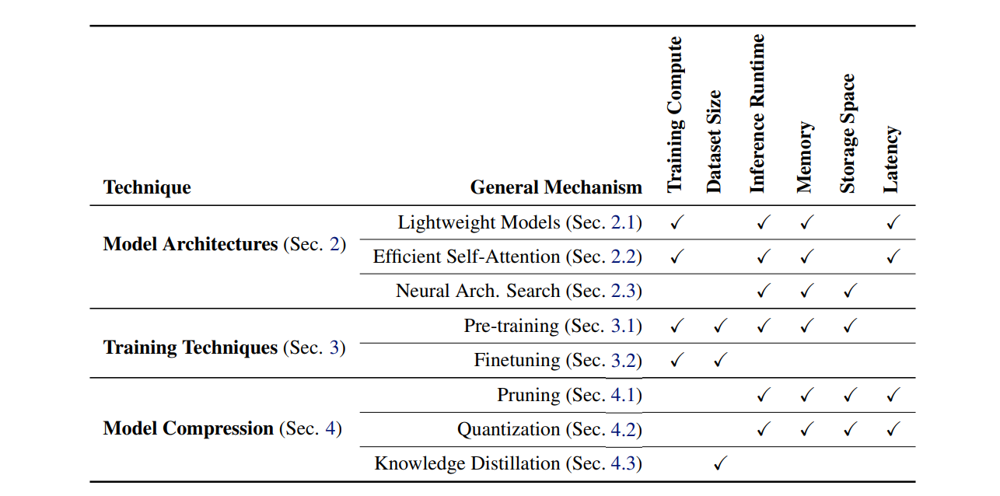

https://arxiv.org/abs/2410.20011

# A Survey of Small Language Models (SLMs)
Chien Van Nguyen, Xuan Shen, Ryan Aponte

# Introduction
- The definition of SLM changes over time. Eg: GPT-2 was once considered to be an LLM(still is). 
Now many SLMs are larger than it in terms of parameter count.
- Primarily to be used in edge devices

# 1. Architectures
- Lightweight encoder-only architectures are mostly optimized versions of BERT. Eg: MobileBERT, DistilBERT
- Lightweight decoder-only models emphasize knowledge distillation, memory overhead optimization, parameter sharing, embedding sharing to enhance efficiency and scalability. They are generally derivations of GPT or Llama.

## Efficient Self-Attention Approximations
- replacing the dot product attention with one which uses locality-sensitivity hashing
- use a sparse routing module based on an online k-means clustering
- linear attention mechanisms. (The authors further show
that transformers with this linear attention mechanism can be viewed as a recurrent neural network which enables faster inference)
- Mamba h introduces a selective state space model with input-dependent transitions, and RWKV which combines elements of transformers and RNNs with a linear attention mechanism.
- a combination of local windowed attention and task-specific global attention which scales linearly with input length, thus being memory efficient
- approximates the self-attention mechanism using a low-rank matrix which reduces the complexity to O(N)
- Nystrom method

## Small Multi-modal Models
- use smaller models can lead to better performance with less parameters

# 2. Training

## Pre-training Techniques
-  Mixed precision training- This approach leverages low-precision representations for forward and backward propagation while maintaining high-precision weights for updates.
- BFLOAT16
- Adafactor, Sophia -> optimisers
- gradient clipping to prevent exploding gradients
- careful initialization
- leverage distributed computing resources efficiently
- Reflection-tuning
- retrieval-augmented generation
- LLM2LLM

# 3. Model Compression Techniques
- Model compression techniques focus on reducing the size and complexity of large pre-trained language models while maintaining their performance.
- These methods are a key approach to deriving SLMs from LLMs

##  Pruning Techniques
- Unstructured pruning removes less significant individual weights, offering fine-grained control and flexibility in reducing model size
- Structured pruning aims to compress LLMs while maintaining performance by removing groups of parameters in a structured manner
  - enables more efficient hardware implementation

## Quantization
-  The GPTQ focuses on layer-wise weight-only quantization, using inverse Hessian matrices to minimize the reconstruction error. 
- AWQ and ZeroQuant take activation into account to assess the importance of weights, enabling more effective optimization for weight quantization
- K/V Cache Quantization , Key-Value cache is specifically quantized for enabling efficient long-sequence length  inference.
- Another challenge of activation quantization lies in the outliers that fall outside the typical activation distribution.
- SmoothQuant
- SpinQuant 
- LLM-QAT, d EdgeQAT -> quantization-aware training (QAT) methods

## Knowledge Distillation
-  involves training an efficient model, known as the “student,” to replicate the behavior of a larger, more complex model, referred to as the “teacher.”
-  Babyllama(58M) developed from Llama using knowledge distillation
   -  A key finding of this work is that distillation from a robust teacher can outperform traditional pre-training on the same dataset.
-  Recent works show that multiple language models can be fused as a teacher towards distilling knowledge into small language models by strategically merging their output probability distributions

# 4. Open Problems
- Hallucination
- Biases
  -  find that larger LLaMA models exhibit increased measured bias
- Edge devices have energy constraints
  - CPU-only inference was found to be generally less efficient than on GPU and that laptops require more energy for inference.
  -  The authors find response token length to be the most effective predictor of energy usage, suggesting that more concise responses can help to extend battery life.
-  Data Privacy
   -  They also find that data towards the end of pre-training is easier to extract, with attention layers as a possible cause.
-  
