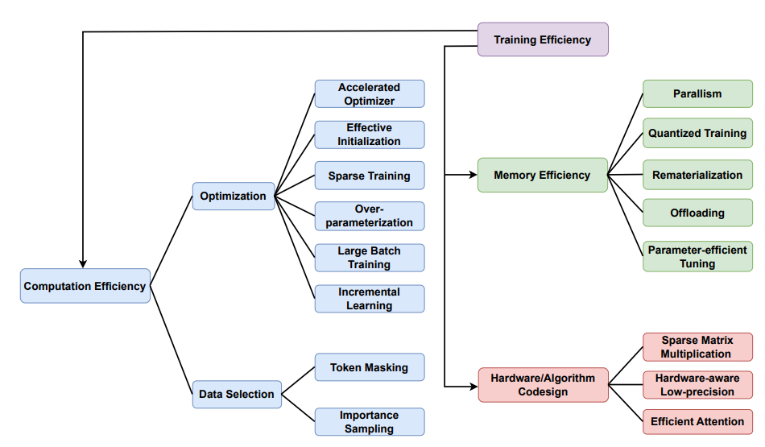

# A Survey on Efficient Training of Transformers
http://arxiv.org/abs/2302.01107

# Intro
- Paper is a survey on training transformers
- As paramter count increases, the need for effective training mechanism also increases
  - to reduce cost
  - faster training
  - Environmental concerns

# 3 ways to achieve efficient training

## 1. Computational efficiency
- Optimizer
  - SGD: classic, not every efficient
  - Adam: combines momentum and Adaptive Learning Rates
  - AdamW: Decouples weight decay from optimisation step
    - reccomended over adam
    - Weight decay is applied directly to the parameters before the optimization step.
  - Lion: (EvoLved Sign Momentum)
    - recent optimiser that keeps track of only momentum with first order gradient
    - claimed to be memory efficient than Adam

- Initialization
  - T-Fixup is a normalization-free initialization method designed to improve the training stability of deep transformers without relying on techniques like layer normalization or gradient clipping
  - Fixup

- Sparse Training
- Overparameterisation
  - It is observed that overparameterization empirically improves both convergence and generalization, with theoretical guarantee though not sufficient.
- Large batch size
