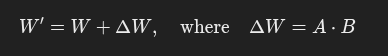
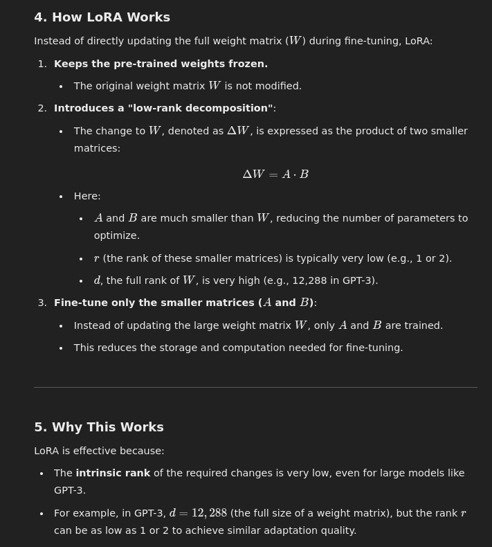

# LORA: LOW-RANK ADAPTATION OF LARGE LANGUAGE MODELS

- Edward Hu,  Yelong Shen - Microsoft Corporation

- We propose Low-Rank Adaptation, or LoRA, which freezes the pre-
trained model weights and injects trainable rank decomposition matrices into each
layer of the Transformer architecture, greatly reducing the number of trainable pa-
rameters for downstream tasks.
- LoRA (Low-Rank Adaptation) is a technique designed to efficiently fine-tune large pre-trained models like language models or vision transformers with significantly reduced computational and storage costs.

## Key Concepts:
Parameter Efficiency: LoRA introduces a small set of trainable parameters instead of modifying the entire pre-trained model. This makes fine-tuning feasible even on systems with limited resources.

Low-Rank Decomposition: The idea behind LoRA is to approximate the updates to the model's weights using low-rank matrices. It decomposes the updates into two smaller matrices, which are easier and cheaper to train.

Frozen Pre-trained Model: During LoRA fine-tuning, the original model's parameters remain frozen. Only the new low-rank adaptation parameters are updated.

Efficiency in Multitasking: LoRA is particularly useful for scenarios where a single pre-trained model needs to be adapted to multiple tasks or domains. The low-rank modules can be task-specific and swapped without affecting the main model.

## How It Works:
Weight Decomposition: Assume the weight matrix 𝑊 of a pre-trained model is updated by adding a learned low-rank matrix 

Then we train only A and B.

###     LoRA possesses several key advantages.
• A pre-trained model can be shared and used to build many small LoRA modules for dif-
ferent tasks. We can freeze the shared model and efficiently switch tasks by replacing the
matrices A and B in Figure 1, reducing the storage requirement and task-switching over-
head significantly.

• LoRA makes training more efficient and lowers the hardware barrier to entry by up to 3
times when using adaptive optimizers since we do not need to calculate the gradients or
maintain the optimizer states for most parameters. Instead, we only optimize the injected,
much smaller low-rank matrices.

• Our simple linear design allows us to merge the trainable matrices with the frozen weights
when deployed, introducing no inference latency compared to a fully fine-tuned model, by
construction.

# Earlier methods
1. Adapter Layers
- Adapter layers are additional trainable layers inserted into a pre-trained model. They allow task-specific fine-tuning without modifying the model's original parameters.
- Small neural network modules (adapter layers) are added between the layers of the pre-trained model.During fine-tuning, only the adapter layers are trained, while the rest of the model remains frozen.
- Adapter Layers Introduce Inference Latency
- This problem gets worse when we need to shard the model
- 

2. Optimizing Input Layer Activations
- Modify activations by appending task-specific embeddings or prompts to the input.
- These additional parameters are the only ones trained, while the model weights remain frozen.
- Directly Optimizing the Prompt is Hard
- 